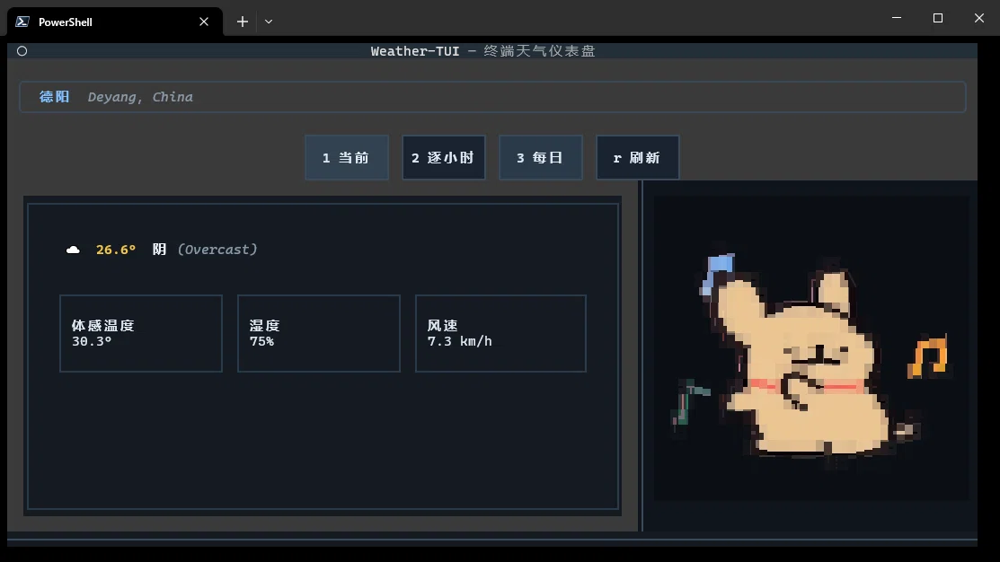

> 📖 简体中文文档：[README.zh-CN.md](README.zh-CN.md)

# 🌤️ SkyViewTUI

> A terminal-based weather dashboard with live GIF animations.

[](https://python.org)
[](https://textualize.io)
[](LICENSE)

---

## 📖 What is SkyViewTUI?

**SkyViewTUI** is a beautiful, keyboard-centric weather dashboard that runs right in your terminal. It displays:

- **Current weather** (temperature, humidity, wind speed, feels-like)
- **Hourly forecast** (next 12 hours)
- **3-day daily forecast**
- **Live GIF animations** in the sidebar (toggle with `n` key)

Built with [Textual](https://textualize.io) and powered by [Open-Meteo](https://open-meteo.com) (no API key required!).

---

## ✨ Features

- 🎨 **Rich TUI** — Beautiful dashboard layout with dynamic background colors based on weather conditions
- 🌍 **Smart Location** — Auto-detect via IP, or manually specify a city via `--city` argument
- 🔄 **Live GIF Playback** — Animated sidebar with cycle-through support (`n` key)
- ⌨️ **Keyboard Shortcuts** — Navigate views with `1` (current), `2` (hourly), `3` (daily), `r` (refresh), `q` (quit)
- 🌡️ **Configurable** — Settings stored in `~/.weather-config.toml` (city, temperature units, theme)
- ☁️ **Weather Icons** — ASCII icons for all weather conditions (☀️🌧️❄️⛈️)
- 📡 **WebDAV Sync** — Sync configuration to cloud (optional)

---

## 🚀 Installation

### Prerequisites

- Python 3.9 or higher
- [pip](https://pip.pypa.io/)

### Steps

```bash
# 1. Clone the repository
git clone https://github.com/sicnutaolei/SkyViewTUI.git
cd SkyViewTUI

# 2. Create and activate a virtual environment
python -m venv .venv
# On Windows:
.venv\Scripts\activate
# On Linux/macOS:
source .venv/bin/activate

# 3. Install dependencies
pip install -e .
```

### Quick Start with pip

```bash
# Install directly from GitHub
pip install git+https://github.com/sicnutaolei/SkyViewTUI.git
skyviewtui --city "Beijing"
```

---

## 🎮 Usage

### Basic usage

```bash
# Auto-detect location via IP
python -m weather_tui.app

# Specify a city
python -m weather_tui.app --city "Beijing"

# Specify a city and a custom GIF
python -m weather_tui.app --city "Deyang" --gif "path/to/your.gif"
```

### Keyboard Shortcuts

| Key | Action |
|-----|--------|
| `1` | Current weather view |
| `2` | Hourly forecast view |
| `3` | 3-day daily forecast view |
| `r` | Refresh weather data |
| `n` or `→` | Next GIF animation |
| `q` | Quit |

---

## ⚙️ Configuration

SkyViewTUI stores your preferences in `~/.weather-config.toml`:

- **Windows**: `C:\Users\<YourName>\.weather-config.toml`
- **Linux / macOS**: `/home/<your_name>/.weather-config.toml`

```toml
city = "Deyang"
units = "celsius"          # "celsius" or "fahrenheit"
theme = "default"

[webdav]
url = "https://dav.jianguoyun.com/dav/"
username = "your_email"
password = "your_app_password"
sync_enabled = false
```

### Config options

- `city`: default city used when `--city` is not provided. The app also updates this when you successfully switch cities.
- `units`: temperature unit. Use `"celsius"` or `"fahrenheit"`.
- `theme`: reserved for future themes; keep `"default"`.
- `webdav.sync_enabled`: set to `true` to upload the config to WebDAV on exit.
- `webdav.url/username/password`: your WebDAV server credentials (e.g. 坚果云 Jianguoyun).

### WebDAV sync

1. Fill in `[webdav]` with your credentials.
2. Set `sync_enabled = true`.
3. On every clean exit the config is uploaded to WebDAV.
4. On another machine, run with `--sync-pull` to download the latest config before launching:

```bash
skyviewtui --sync-pull
```

You can also edit `.weather-config.toml` manually; the app reads it on startup.

---

## 🎞️ GIF Files

SkyViewTUI renders a GIF in the right sidebar using [chafa](https://hpjansson.org/chafa/).

- **Default GIF folder**: `weather_tui/img/`. Place any `.gif` files there. At startup the app plays the first one in sorted order; press `n` or `→` to cycle through all GIFs in that folder.
- **Custom GIF**: start the app with `--gif path/to/your.gif`.
- **Included GIFs**: the repository ships with sample GIFs under `weather_tui/img/`, so the animation works immediately after `pip install -e .`.

---

## 📂 Project Structure

```
SkyViewTUI/
├── weather_tui/
│   ├── app.py              # Main application entry
│   ├── screens/
│   │   └── main.py         # Main TUI screen
│   ├── weather/
│   │   ├── api.py          # Open-Meteo API calls
│   │   ├── geocode.py      # City name → coordinates
│   │   ├── ip_location.py  # IP-based location
│   │   └── weather_icons.py # WMO code mapping
│   ├── config/
│   │   ├── manager.py      # Config read/write
│   │   └── webdav.py       # WebDAV sync
│   ├── widgets/
│   │   └── gif_player.py   # GIF animation player
│   └── img/                # Default GIF animations
│       ├── 01.gif
│       └── ...
├── app.tcss                # Textual CSS styles
├── pyproject.toml          # Dependencies and metadata
├── screenshot.webp         # App screenshot
├── .gitignore
├── README.md
└── README.zh-CN.md
```

---

## 🛠️ Dependencies

- [Textual](https://textualize.io) — TUI framework
- [httpx](https://www.python-httpx.org/) — Async HTTP client
- [Pillow](https://python-pillow.org/) — Image processing
- [chafa.py](https://github.com/hpjansson/chafa) — GIF to ANSI art conversion
- [tomli-w](https://github.com/hukkin/tomli-w) — TOML writing
- [webdavclient3](https://github.com/ezhov/webdavclient3) — WebDAV sync (optional)

---

## 📸 Screenshots



---

## 📄 License

This project is licensed under the MIT License — see the [LICENSE](LICENSE) file for details.

---

## 🙏 Acknowledgements

- [Open-Meteo](https://open-meteo.com/) for the free weather API
- [Textual](https://textualize.io/) for the amazing TUI framework
- [chafa](https://hpjansson.org/chafa/) for terminal image rendering

---

## 🤝 Contributing

Contributions are welcome! Feel free to open issues or submit pull requests.

---

**Made with ❤️ and Python**
